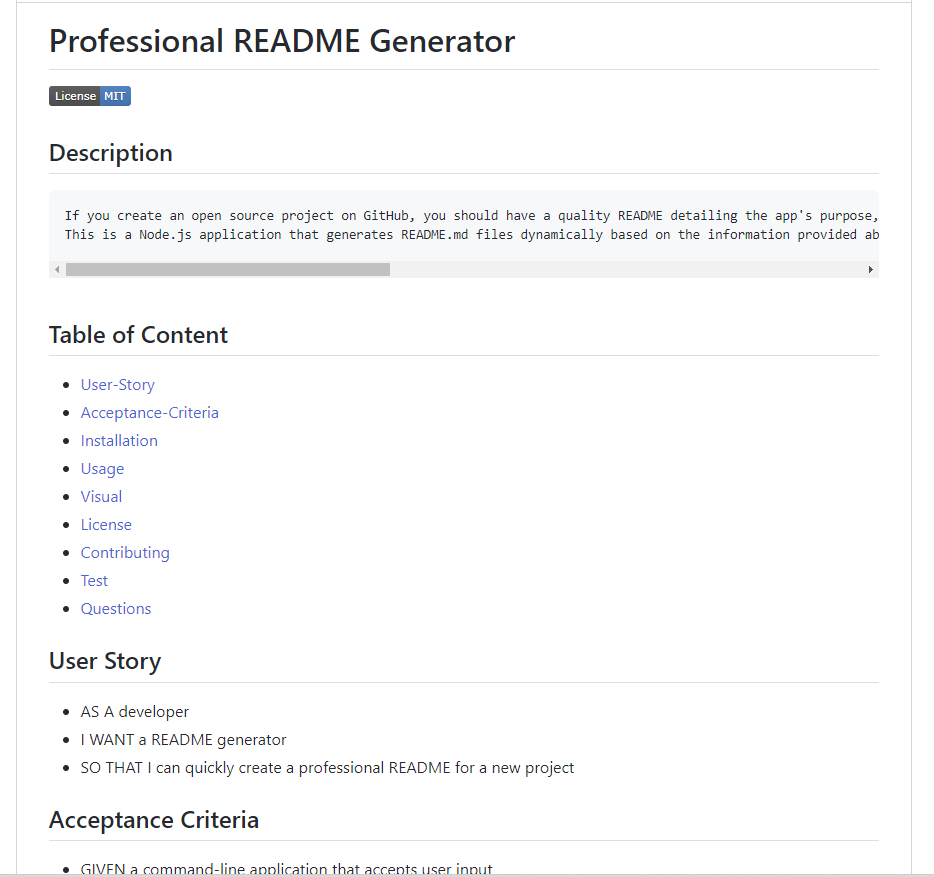

# Professional README Generator

## Description

    If you create an open source project on GitHub, you should have a quality README detailing the app's purpose, how to use it, how to install it, how to report issues, and how to contribute to make sure other developers can use the project and contribute to its success.
    This is a Node.js application that generates README.md files dynamically based on the information provided about your project when running with the command line.

## Table of Content

- [User-Story](#user-story)
- [Acceptance-Criteria](#acceptance-criteria)
- [Installation](#installation)
- [Usage](#usage)
- [Visual](#visual)
- [License](#license)
- [Contributing](#contributing)
- [Test](#test)
- [Questions](#questions)

## User Story

- AS A developer
- I WANT a README generator
- SO THAT I can quickly create a professional README for a new project

## Acceptance Criteria

- GIVEN a command-line application that accepts user input
- WHEN I am prompted for information about my application repository
- THEN a high-quality, professional README.md is generated with the title of my project and sections entitled - Description, Table of Contents, Installation, Usage, License, Contributing, Tests, and Questions
- WHEN I enter my project title
- THEN this is displayed as the title of the README
- WHEN I enter a description, installation instructions, usage information, contribution guidelines, and test instructions
- THEN this information is added to the sections of the README entitled Description, Installation, Usage, Contributing, and Tests
- WHEN I choose a license for my application from a list of options
- THEN a badge for that license is added near the top of the README and a notice is added to the section of the README entitled License that explains which license the application is covered under
- WHEN I enter my GitHub username
- THEN this is added to the section of the README entitled Questions, with a link to my GitHub profile
- WHEN I enter my email address
- THEN this is added to the section of the README entitled Questions, with instructions on how to reach me with additional questions
- WHEN I click on the links in the Table of Contents
- THEN I am taken to the corresponding section of the README

## Installation

- In order to generate your own README, simply git clone the repository to your local so that you have the Node project there on your local machine.

- Use _npm install_ to install the npm package dependencies listed in your package.json. The inquiry package (https://www.npmjs.com/package/inquirer) prompts you to input your command line arguments.

- Using the command line, run node index.js to begin the application. The README will be generated once you answer the prompts in your command line.

- When you are finished answering all the prompts, a README file will be created at the root of the repository with the name 'yourREADME.md'.

## Usage

View walk through video here - [Screencastify](https://drive.google.com/file/d/13osLhwOkqR7Gs1ioObGEDfdblZIi-kyk/view) 

- As soon as you run _node index.js_, the application uses the inquirer package to ask you a series of questions about your GitHub and your project.

- Your responses are then used by the application to fetch your GitHub profile from the GitHub API, including your GitHub profile picture (avatar) and email address.

- After that, the application will produce markdown and a table of contents for your README based upon your answers to the Inquirer prompts. If you do not answer the optional questions such, that section will not be included in your README.
- Last but not least, writeToFile generates your project's README.md file.

## License

    MIT license has been applied to this project

## Visual

## Contributing

    It would be great if you could contribute in any way.

## Test

    Simply answer the sequence of question to test the project.

## Questions

- I am available at the following email address if you have any questions: emandaabyou@gmail.com
- Here is my GitHub account: [ghashe](https://github.com/ghashe)

---

_This README has been generated by ❤ [Professional-README-generator](https://github.com/ghashe/professional-README-generator) © 2022_

---
