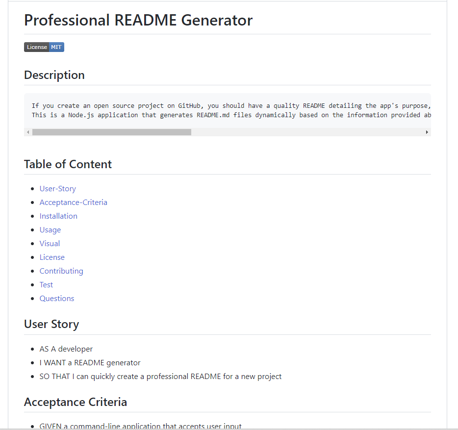

# Professional README Generator

## Description
    If you create an open source project on GitHub, you should have a quality README detailing the app's purpose, how to use it, how to install it, how to report issues, and how to contribute to make sure other developers can use the project and contribute to its success. This is a Node.js application that generates README.md files dynamically based on the information provided about your project when running with the command line.

## Table of Content
- [Installation](#installation)
- [Usage](#usage)
- [Visual](#visual)
- [License](#license)
- [Contributing](#contributing)
- [Test](#test)
- [Questions](#questions)
    
## Installation
    Git clone the repo to your local so that you have the project and then use npm install to install the project
## Usage
    git clone the repo to you local, run npm install to install the project and then answer the series of questions
## License
    MIT license has been applied to this project

## Visual

## Contributing
    It would be greate if you could contributr in any way
## Test
    Simply answer the series of questions
## Questions
    I am available at the following email address if you have any questions: emandaabyou@gmail.com

    Here is my GitHub account:  [ghashe](https://github.com/ghashe)

---
_This README has been generated by ❤  [Professional-README-generator]( https://github.com/ghashe/professional-README-generator) © 2022_  
  
---